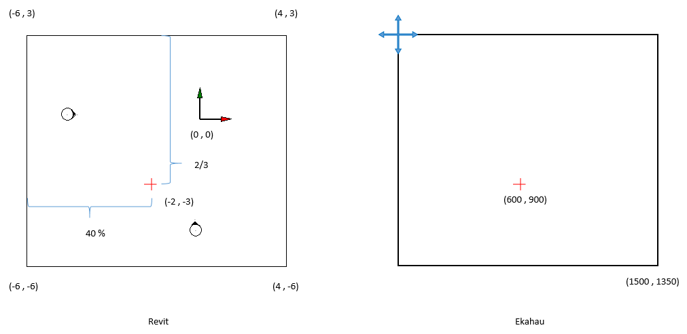
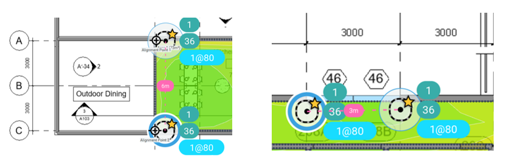
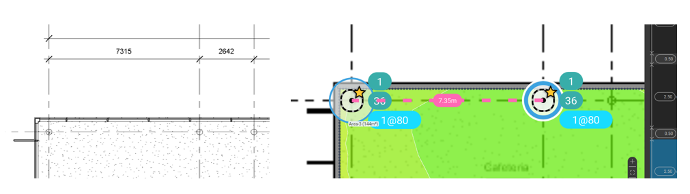

# Documentation du projet

## <u>Installation</u>

1.
Créer un dossier 'Create' dans le dossier 'repos' de Visual Studio Community.

2.
Copier le dossier 'Create' (repo) et le fichier 'Create.sln' à l’intérieur du dossier 'Create' (local).

3.
> Le dossier `packages/` n’est pas inclus dans le repo. Les dépendances doivent être restaurées.

### Avec Visual Studio Community

- Ouvrir le fichier `.sln` dans Visual Studio. Visual Studio détectera les packages manquants et les restaurera automatiquement.
- Si les packages ne se restaurent pas automatiquement :
    - Aller dans :
        ```
        Outils → Gestionnaire de packages NuGet → Console du gestionnaire de packages
        ```
    - Exécuter :

        ```powershell
        Update-Package -reinstall
        ```

        ou :

        ```powershell
        nuget restore
        ```

    - Compiler ensuite le projet avec `Ctrl + Maj + B`.

4.
Copier le fichier 'Create.addin' dans le dossier 'Addins\<`version`>' de Revit.

5.
Mettre à jour la ligne :
  ```
  <Assembly>C:\Users\pelon\source\repos\Create\Create\bin\Debug\Create.dll</Assembly>
  ```

du fichier 'Create.addin' pour qu’elle pointe vers le fichier 'Create.dll' situé dans 'Create\bin\Debug'.
 
Copier le contenu du dossier src\tools (repo) dans 'Create\bin\Debug'.

---

## <u>Usage</u>

- Deux vidéos démonstratives se trouvent dans le dossier partagé du projet sur Google Docs.

- Vidéo de démonstration sur YouTube (partie Revit uniquement) [https://www.youtube.com/watch?v=ZQKJaEJjRiY](https://www.youtube.com/watch?v=ZQKJaEJjRiY)


---

## <u>Development</u>

### Description des fichiers Ekahau

Un fichier Ekahau est une archive ZIP avec l’extension .esx. Ce fichier compressé contient les fichiers suivants :
    ```
    accessPoints.json
    antennaTypes.json
    applicationProfiles.json
    areas.json
    attenuationAreaTypes.json
    buildingFloors.json
    buildings.json
    deviceProfiles.json
    floorPlans.json
    floorTypes.json
    image-4f9c9497-5249-4deb-a5c6-7243d383ec86
    images.json
    networkCapacitySettings.json
    project.json
    projectConfiguration.json
    projectHistory.json
    referencePoints.json
    requirements.json
    simulatedRadios.json
    usageProfiles.json
    version 
    wallPoints.json
    wallSegments.json
    wallTypes.json
    ```

Voici la description des fichiers pertinents pour le développement du plugin.

- accesPoints.json

La liste des points d’accès simulés avec les informations suivantes :
    ```json
    "location": {
        "floorPlanId": "3f5f840b-3173-4bee-a2e0-e9003e74318b",
        "coord": {
          "x": 501.2613181244604,
          "y": 291.2141768963513
        }
      },
    "name": "Simulated AP-050",
    "mine": true,
    "hidden": false,
    "userDefinedPosition": false,
    "noteIds": [],
    "vendor": "Generic",
    "model": "Wi-Fi 6E Tri-Band Radio",
    "tags": [],
    "id": "a233a0e1-385e-4de3-9fd9-93ac43ae8f34",
    "status": "CREATED"
    ```

- applicationProfiles.json

Contient une liste de situations d’utilisation quotidienne du réseau Wi-Fi pour réaliser la simulation.
    ```json
    "name": "Music, Spotify",
    "key": "ApplicationProfile.StreamingMusicSpotify",
    "accessCategory": "AC_BE",
    "applicationProtocols": [
      "UNKNOWN"
    ],
    "packetSize": 1500,
    "bitRate": 167772.16,
    "fullDuplex": false,
    "id": "0ba3af5e-1c50-4496-b3d6-b9af3470dd3c",
    "status": "CREATED"
    ```

- areas.json

Contient la liste des zones dans lesquelles la simulation sera réalisée (idéalement une par view).
    ```json
    "floorPlanId": "d64f7139-62d7-42bb-8638-cb6ba78a8918",
    "name": "Area-27",
    "noteIds": [],
    "requirementId": "454dc1cb-9e22-4bec-8b8b-e15d86e273c1",
    "capacityItems": [],
    "color": "#2c3e50",
    "area": [
      {
        "x": 766.1051284721585,
        "y": 342.91729942297724
      },
      {
        "x": 805.245153473507,
        "y": 342.9172994229774
      },
      {
        "x": 805.245153473507,
        "y": 308.50550883662896
      },
      {
        "x": 766.1051284721585,
        "y": 308.50550883662885
      }
    ],
    "id": "76decdbb-34f1-47f8-913d-934f6fb48aad",
    "status": "CREATED"
    ```

- attenuationAreaTypes.json

Elle contient une liste d’objets représentant l’environnement réel, qui seront attribués à une zone pendant la simulation.
    ```json
    "name": "Elevator",
    "key": "elevator",
    "color": "#8E8E8E",
    "propagationProperties": [
      {
        "band": "TWO",
        "attenuationFactor": 17.0,
        "reflectionCoefficient": 0.5,
        "diffractionCoefficient": 11.0
      },
      {
        "band": "FIVE",
        "attenuationFactor": 17.0,
        "reflectionCoefficient": 0.5,
        "diffractionCoefficient": 11.0
      },
      {
        "band": "SIX",
        "attenuationFactor": 17.0,
        "reflectionCoefficient": 0.5,
        "diffractionCoefficient": 11.0
      }
    ],
    "lowerEdge": 0.0,
    "id": "1f0f083c-6604-48e4-9b91-219b8f2afa39",
    "status": "CREATED"
    ```

- buildingFloors.json

Contient la liste des niveaux (étages/views) que comporte le bâtiment.
    ```json
    "floorPlanId": "3f5f840b-3173-4bee-a2e0-e9003e74318b",
    "buildingId": "f4a0687e-7203-45ca-9e02-0f0b9538250a",
    "floorTypeId": "1b3ed0d7-4bb9-47c4-b3f1-993ba66ad628",
    "floorNumber": 2,
    "height": 2.5,
    "thickness": 0.5,
    "id": "3d5bd4cf-2e87-46f2-906d-729ca9c90eeb",
    "status": "CREATED"
    ```

- buildings.json

contient la liste des bâtiments (dans notre cas, il y en aura toujours un seul).
    ```json
    "name": "Building 1",
    "tags": [],
    "id": "f4a0687e-7203-45ca-9e02-0f0b9538250a",
    "status": "CREATED"
    ```

- floorPlans.json

La liste des images de fond pour chaque étage dans la simulation.
    ```json
    "name": "exported_view - Floor Plan - 01 - Entry Level - Furniture Layout.bmp",
    "width": 1500.0,
    "height": 1400.0,
    "metersPerUnit": 0.0524181116943232,
    "imageId": "e3657068-273e-4836-8ea7-bad33db464f5",
    "gpsReferencePoints": [],
    "floorPlanType": "FSPL",
    "cropMinX": 0.0,
    "cropMinY": 0.0,
    "cropMaxX": 1500.0,
    "cropMaxY": 1400.0,
    "rotateUpDirection": "UP",
    "tags": [],
    "id": "f400bd78-2a6e-4b69-8d9c-31489c47f65c",
    "status": "CREATED"
    ```

- fllorTypes.json

Contient une liste d’objets avec les informations pertinentes pour simuler les conditions réelles de chaque étage du bâtiment pendant la simulation, en fonction du type de sol sélectionné.
    ```json
    "key": "FloorTypes.OfficeUS",
    "name": "Office (US)",
    "propagationProperties": [
      {
        "band": "TWO",
        "attenuationFactor": 30.0,
        "reflectionCoefficient": 0.5,
        "diffractionCoefficient": 11.0
      },
      {
        "band": "FIVE",
        "attenuationFactor": 30.0,
        "reflectionCoefficient": 0.5,
        "diffractionCoefficient": 11.0
      },
      {
        "band": "SIX",
        "attenuationFactor": 30.0,
        "reflectionCoefficient": 0.5,
        "diffractionCoefficient": 11.0
      }
    ],
    "isDefault": true,
    "id": "1b3ed0d7-4bb9-47c4-b3f1-993ba66ad628",
    "status": "CREATED"
    ```

- images.json

La liste des images (maps) qui seront utilisées comme background.
    ```json
    "imageFormat": "BMP",
    "resolutionWidth": 1500.0,
    "resolutionHeight": 1400.0,
    "id": "e3657068-273e-4836-8ea7-bad33db464f5",
    "status": "CREATED"
    ```

- project.json

Contient les informations générales du fichier : version, date de création, date de modification, etc.

- projectHistory.json

Ce fichier contient une liste d’objets contenant des informations générales sur le fichier Ekahau. Un nouvel élément est créé à chaque fois que le projet est enregistré.
    ```json
    "parentIds": [],
    "timestamp": "2025-06-08T09:29:38.251-07:00",
    "projectId": "98292912-bfbd-449c-9613-69ed39b04ee0",
    "projectName": "file",
    "productName": "Ekahau AI Pro",
    "productVersion": "11.6.0.1",
    "schemaVersion": "1.8.0",
    "operation": "LOCAL_SAVE",
    "platform": "Windows 10 64-bit",
    "id": "e6921a89-33f8-4daf-889e-b12daf402367",
    "status": "CREATED"
    ```

- referencePoints.json

Ce fichier contient la position des points de référence par étage, qui serviront à aligner tous les étages du bâtiment.

- requirements.json

Ce fichier contient l’ensemble des normes techniques des réseaux locaux (LAN) et spécifie l’ensemble des protocoles de contrôle d’accès au média (MAC) et de la couche physique (PHY) pour la mise en œuvre de la communication informatique sans fil (WLAN) sur chaque étage, en fonction du profil sélectionné. Exemple IEEE802_11.

- usageProfiles.json

Ce fichier contient une liste de profils d’utilisation quotidienne du réseau Wi-Fi.
    ```json
    "name": "Streaming, Video",
    "key": "UsageProfile.StreamingVideo",
    "editable": false,
    "applicationProfileIds": [
      "14c0fd8b-d300-49ad-a049-4224652c0260"
    ],
    "id": "e0e45c8a-5a34-4f47-87cf-3002818e0ba7",
    "legacyId": 12,
    "status": "CREATED"
    ```

- wallPoints.json

Ce fichier contient la liste de tous les points correspondant au début et à la fin de tous les éléments de la simulation (murs, portes, fenêtres, etc.), pour chaque étage.
    ```json
    "location": {
      "floorPlanId": "3f5f840b-3173-4bee-a2e0-e9003e74318b",
      "coord": {
        "x": 478.225024907208,
        "y": 343.993396283716
      }
    },
    "id": "bbb58c7d-04fa-487d-873d-8baefa34a5e8",
    "status": "CREATED"
    ```

- wallSegments.json

Ce fichier contient une liste de segments reliant deux points pour former les éléments de la simulation (murs, portes, fenêtres, etc.).
    ```json
    "wallPoints": [
      "d64599a4-1a0b-4768-a7ee-132d30543c6f",
      "029b595f-f58a-42cc-aaed-e55d7c9fcab0"
    ],
    "wallTypeId": "40fbd872-e1f2-4b8b-9ff2-9aaf67f449fb",
    "originType": "WALL_TOOL",
    "id": "f2680402-2b32-43b7-ab48-37f2339679c3",
    "status": "CREATED"
    ```

- wallTypes.json

Ce fichier contient une liste avec les informations nécessaires pour la simulation pour chaque type de mur.
    ```json
    "name": "Wall, Concrete",
    "key": "Concrete",
    "color": "#8E8E8E",
    "propagationProperties": [
      {
        "band": "TWO",
        "attenuationFactor": 24.0,
        "reflectionCoefficient": 0.4982,
        "diffractionCoefficient": 17.0
      },
      {
        "band": "FIVE",
        "attenuationFactor": 24.0,
        "reflectionCoefficient": 0.4982,
        "diffractionCoefficient": 17.0
      },
      {
        "band": "SIX",
        "attenuationFactor": 24.0,
        "reflectionCoefficient": 0.4982,
        "diffractionCoefficient": 17.0
      }
    ],
    "thickness": 0.5,
    "lowerEdge": 0.0,
    "keybindNumber": 5,
    "id": "b4e1fe72-4aca-4092-b646-000f6426536b",
    "status": "CREATED"
    ```

<!-- - Structure du code -->

---

## <u>Systèmes de coordonnées Revit et Ekahau</u>

## Conversion des coordonnées de Revit vers Ekahau

Pour convertir les coordonnées de Revit en coordonnées utilisables dans Ekahau, deux éléments essentiels doivent être pris en compte :

- Revit utilise un système de coordonnées absolu en **pieds**.
- Ekahau utilise un système de coordonnées absolu en **pixels**.

### Exemple illustré



Dans l'image ci-dessus :

- À gauche, nous avons une vue hypothétique de Revit. Le système de coordonnées absolu y est représenté par les flèches **verte** (axe Y) et **rouge** (axe X), ainsi qu’un **Crop Region** (région de découpe). Étant donné que l'origine est **absolue** et commune à toutes les vues, le centre de la région de découpe ne coïncide pas nécessairement avec l’origine du système de coordonnées.
- À droite, nous voyons une **image** (Map) dans Ekahau. Remarquez que l'origine de la carte se trouve dans le coin supérieur gauche, ce qui signifie qu’il **n’existe pas de coordonnées négatives dans Ekahau**.

La taille de l’image dépend de la taille définie par l’utilisateur dans Revit. Pour cet exemple, nous avons exporté une image de **1500 x 1350 pixels**, afin de respecter les proportions de la vue dans Revit.

### Calcul d’un point

Dans cet exemple, nous avons placé un point dans Revit à la position **(-2, -3)**.

- La largeur totale de la région de découpe est de **10 pieds**.
- La hauteur totale est de **9 pieds**.

Pour convertir cette position vers Ekahau, il faut calculer la proportion du point par rapport à la taille de la Crop Region, en partant de la **position de l’origine de l’image Ekahau** (coin supérieur gauche).

#### Calcul des proportions

- Pour **X** : entre -6 et -2, il y a 4 pieds → 4 / 10 = **0,4** (soit 40 %)
- Pour **Y** : entre 3 et -3, il y a 6 pieds → 6 / 9 = **2/3**

#### Conversion en pixels

- Pour **X** : 0,4 × 1500 = **600 pixels**
- Pour **Y** : (2/3) × 1350 = **900 pixels**

### Conclusion

La position du point **(-2, -3)** dans Revit correspond à la position **(600, 900)** dans Ekahau.

## <u>Correspondance d’échelle Revit - Ekahau </u>

## Définir l’échelle dans Ekahau

Pour définir l’échelle dans Ekahau, il suffit d’ajouter une ligne `"metersPerUnit"` avec la valeur appropriée pour chaque étage dans le fichier `floorPlans.json`.

Cette valeur se calcule en divisant la taille réelle (en mètres) d’un élément connu — comme un mur, une porte ou une fenêtre — par sa longueur en pixels sur l’image.

### Exemple

Prenons l’exemple précédent : supposons qu’il y ait un mur qui va du point **(-2, -3)** jusqu’à l’origine absolue **(0, 0)**.

- La position du point **(-2, -3)** dans Ekahau est **(600, 900)** pixels.
- L’origine (0, 0) correspond à **(900, 450)** pixels.

#### 1. Longueur réelle du mur en pieds

On utilise le théorème de Pythagore :

Longueur = √[(-2)² + (-3)²]  
Longueur = √(4 + 9) = √13 ≈ **3,6056 pieds**

Converti en mètres :  
3,6056 × 0,3048 ≈ **1,0998 mètres**

#### 2. Longueur du mur en pixels

Longueur = √[(900 - 600)² + (900 - 450)²]  
Longueur = √(300² + 450²) = √(202500 + 90000)  
Longueur ≈ **540,83 pixels**

#### 3. Calcul de l’échelle

metersPerUnit = 1,0998 / 540,83 ≈ **0,002033**

### Conclusion

Dans cet exemple, la valeur à insérer dans `floorPlans.json` serait :

```json
"metersPerUnit": 0.002033
```





## <u>Troubleshooting</u>

- Erreurs courantes et solutions

    À venir

- Questions fréquentes (FAQ)

    À venir
