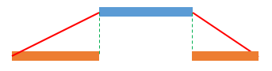
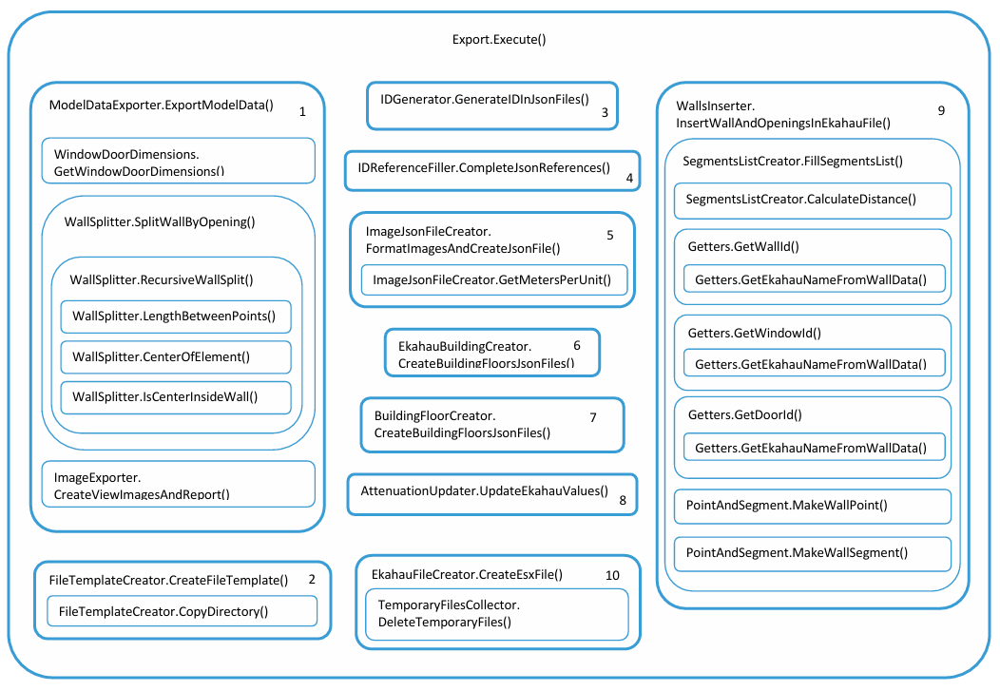

# Documentation du projet

## <u>Installation</u>

1.
Créer un dossier 'Create' dans le dossier 'repos' de Visual Studio Community.

2.
Copier le dossier 'Create' (repo) et le fichier 'Create.sln' à l’intérieur du dossier 'Create' (local).

3.
> Le dossier `packages/` n’est pas inclus dans le repo. Les dépendances doivent être restaurées.

### Avec Visual Studio Community

- Ouvrir le fichier `.sln` dans Visual Studio. Visual Studio détectera les packages manquants et les restaurera automatiquement.
- Si les packages ne se restaurent pas automatiquement :
    - Aller dans :
        ```
        Outils → Gestionnaire de packages NuGet → Console du gestionnaire de packages
        ```
    - Exécuter :

        ```powershell
        Update-Package -reinstall
        ```

        ou :

        ```powershell
        nuget restore
        ```

    - Compiler ensuite le projet avec `Ctrl + Maj + B`.

4.
Copier le fichier 'Create.addin' dans le dossier 'Addins\<`version`>' de Revit.

5.
Mettre à jour la ligne :
  ```
  <Assembly>C:\Users\pelon\source\repos\Create\Create\bin\Debug\Create.dll</Assembly>
  ```

du fichier 'Create.addin' pour qu’elle pointe vers le fichier 'Create.dll' situé dans 'Create\bin\Debug'.
 
Copier le contenu du dossier src\tools (repo) dans 'Create\bin\Debug'.

---

## <u>Usage</u>

- Deux vidéos démonstratives se trouvent dans le dossier partagé du projet sur Google Docs.

- Vidéo de démonstration sur YouTube (partie Revit uniquement) [https://www.youtube.com/watch?v=ZQKJaEJjRiY](https://www.youtube.com/watch?v=ZQKJaEJjRiY)


---

## <u>Development</u>

### Description des fichiers Ekahau

Un fichier Ekahau est une archive ZIP avec l’extension .esx. Ce fichier compressé contient les fichiers suivants :
    ```
    applicationProfiles.json
    attenuationAreaTypes.json
    buildingFloors.json
    buildings.json
    deviceProfiles.json
    floorPlans.json
    floorTypes.json
    images.json
    networkCapacitySettings.json
    project.json
    projectConfiguration.json
    projectHistory.json
    requirements.json
    usageProfiles.json
    wallPoints.json
    wallSegments.json
    wallTypes.json
    ```

Comme ces informations sont publiques, seuls les fichiers consultés ou modifiés par le code seront expliqués, 
et seules les parties pertinentes de chaque fichier seront montrées.

#### applicationProfiles.json
Ce fichier n’est ni modifié ni consulté par le code.

#### attenuationAreaTypes.json
Ce fichier n’est ni modifié ni consulté par le code.

#### buildingFloors.json
Ekahau permet de créer un bâtiment en utilisant les différents étages (views) du modèle Revit, ce qui permet de simuler la propagation 
d’internet depuis les points d’accès à travers les différents étages.

Ce fichier contient les informations nécessaires pour représenter chaque niveau du bâtiment.
Ce fichier est constitué d’une liste de étages (floors) ; ci-dessous se trouve un exemple d’une telle instance de la liste.

  ```json
    {
      "floorPlanId": "3f5f840b-3173-4bee-a2e0-e9003e74318b",
      "buildingId": "f4a0687e-7203-45ca-9e02-0f0b9538250a",
      "floorTypeId": "1b3ed0d7-4bb9-47c4-b3f1-993ba66ad628",
      "floorNumber": 2,
      "height": 2.5,
      "thickness": 0.5,
      "id": "3d5bd4cf-2e87-46f2-906d-729ca9c90eeb",
      "status": "CREATED"
    }
  ```

#### buildings.json
Contient la liste des bâtiments (dans notre cas, il y en aura toujours un seul).

#### deviceProfiles.json
Ce fichier n’est ni modifié ni consulté par le code.

#### floorPlans.json
Chaque vue dans le modèle Revit est représentée par un étage dans Ekahau. Ce fichier contient les informations de chaque étage, y compris l’image de fond correspondante.
Ce fichier est constitué d’une liste de étages (views) ; ci-dessous se trouve un exemple d’une telle instance de la liste.

  ```json
    {
      "name": "exported_view - Floor Plan - Level 1.bmp",
      "width": 1500.0,
      "height": 1267.0,
      "metersPerUnit": 0.02683082676480316,
      "imageId": "294e9d7c-18d4-4345-b29e-75208499a2da",
      "gpsReferencePoints": [],
      "floorPlanType": "FSPL",
      "cropMinX": 0.0,
      "cropMinY": 0.0,
      "cropMaxX": 1500.0,
      "cropMaxY": 1267.0,
      "rotateUpDirection": "UP",
      "tags": [],
      "id": "51213b74-6cd4-496d-8669-155f9f02607c",
      "status": "CREATED"
    }
  ```

#### floorTypes.json
Ce fichier contient les caractéristiques de propagation du signal pour différents types de planchers que l’on trouve dans des bâtiments courants tels que des bureaux, 
des hôtels, etc. Comme le type de plancher varie selon chaque modèle Revit, le code en sélectionne un par défaut, et l’utilisateur doit choisir le type de plancher 
correct une fois que le fichier est ouvert avec Ekahau.

#### images.json
Ekahau enregistre un fichier contenant la liste des images qui seront utilisées dans le modèle comme fonds.
Ce fichier contient cette liste ; le champ « id » fait référence au nom de l’image, donc le nom du fichier image est : image-&lt;id&gt;.
Ce fichier est constitué d’une liste de images ; ci-dessous se trouve un exemple d’une telle instance de la liste.
  ```json
    {
    "imageFormat": "BMP",
    "resolutionWidth": 1500.0,
    "resolutionHeight": 1400.0,
    "id": "e3657068-273e-4836-8ea7-bad33db464f5",
    "status": "CREATED"
    }
  ```

#### networkCapacitySettings.json
Ce fichier n’est ni modifié ni consulté par le code.

#### project.json
Contient les informations générales du fichier : name, version, date de création, date de modification, etc.
La date de création est ajoutée manuellement au moment de la création du fichier à l’aide du plugin.

#### projectConfiguration.json
Ce fichier n’est ni modifié ni consulté par le code.

#### projectHistory.json
Ce fichier contient l’historique des modifications apportées au modèle.
Ce fichier n’est ni modifié ni consulté par le code.

#### requirements.json
Ce fichier contient l’ensemble des normes techniques des réseaux locaux (LAN) et spécifie l’ensemble des protocoles de contrôle d’accès au média (MAC) 
et de la couche physique (PHY) pour la mise en œuvre de la communication informatique sans fil (WLAN) sur chaque étage, 
en fonction du profil sélectionné. Exemple IEEE802_11.
Ce fichier n’est ni modifié ni consulté par le code.

#### usageProfiles.json
Ce fichier n’est ni modifié ni consulté par le code.

#### wallPoints.json
Ce fichier contient la liste de tous les points correspondant au début et à la fin de tous les éléments de la simulation (murs, portes, fenêtres, etc.), 
pour chaque étage. Ce fichier est constitué d’une liste de wallPoints ; ci-dessous se trouve un exemple d’une telle instance de la liste.
  ```json
    {
      "location": {
        "floorPlanId": "51213b74-6cd4-496d-8669-155f9f02607c",
        "coord": { "x": 841.31512950818, "y": 573.585663952959 }
      },
      "id": "9209f1a2-c61f-46fa-b9f7-8581fd97dd02",
      "status": "CREATED"
    }
  ```

#### wallSegments.json
Ce fichier contient une liste de segments reliant deux points pour former les éléments de la simulation (murs, portes, fenêtres, etc.).
Ce fichier est constitué d’une liste de wallSegments ; ci-dessous se trouve un exemple d’une telle instance de la liste.
  ```json
    {
      "wallPoints": ["9209f1a2-c61f-46fa-b9f7-8581fd97dd02", "8c76e652-0717-4fc1-bdd7-f51de423d4d5"],
      "wallTypeId": "e2713a0a-d747-45b1-8b5f-efa334b32348",
      "originType": "WALL_TOOL",
      "id": "ada4bd7b-d3be-42bd-8ce8-c4bbb715a9c6",
      "status": "CREATED"
    },
  ```

#### wallTypes.json
Ce fichier contient les informations pour chaque type de mur, comme son facteur d’atténuation et son épaisseur.
Pour trouver le facteur d’atténuation affiché dans Ekahau, il est nécessaire de multiplier le facteur d’atténuation par l’épaisseur du mur.
Ce fichier est constitué d’une liste de murs ; ci-dessous se trouve un exemple d’une telle instance de la liste.
  ```json
    {
      "name": "Window, Thick",
      "key": "ThickWindow",
      "color": "#ADE1FF",
      "propagationProperties": [
        {
          "band": "SIX",
          "attenuationFactor": 200.0,
          "reflectionCoefficient": 0.6944,
          "diffractionCoefficient": 11.0
        },
        {
          "band": "TWO",
          "attenuationFactor": 200.0,
          "reflectionCoefficient": 0.6944,
          "diffractionCoefficient": 11.0
        },
        {
          "band": "FIVE",
          "attenuationFactor": 200.0,
          "reflectionCoefficient": 0.6944,
          "diffractionCoefficient": 11.0
        }
      ],
      "thickness": 0.015,
      "lowerEdge": 0.0,
      "keybindNumber": 9,
      "id": "9624a855-0f43-45eb-abc1-3998111c54f9",
      "status": "CREATED"
    },
  ```

<!-- - Structure du code -->

---

## <u>Systèmes de coordonnées Revit et Ekahau</u>

### Conversion des coordonnées de Revit vers Ekahau

Pour convertir les coordonnées de Revit en coordonnées utilisables dans Ekahau, deux éléments essentiels doivent être pris en compte :

- Revit utilise un système de coordonnées absolu en **pieds**.
- Ekahau utilise un système de coordonnées absolu en **pixels**.

#### Exemple illustré


Dans l'image ci-dessus :

- À gauche, nous avons une vue hypothétique de Revit. Le système de coordonnées absolu y est représenté par les flèches **verte** (axe Y) et **rouge** (axe X), ainsi qu’un **Crop Region** (région de découpe). Étant donné que l'origine est **absolue** et commune à toutes les vues, le centre de la région de découpe ne coïncide pas nécessairement avec l’origine du système de coordonnées.
- À droite, nous voyons une **image** (Map) dans Ekahau. Remarquez que l'origine de la carte se trouve dans le coin supérieur gauche, ce qui signifie qu’il **n’existe pas de coordonnées négatives dans Ekahau**.

La taille de l’image dépend de la taille définie par l’utilisateur dans Revit. Pour cet exemple, nous avons exporté une image de **1500 x 1350 pixels**, afin de respecter les proportions de la vue dans Revit.

#### Calcul d’un point

Dans cet exemple, nous avons placé un point dans Revit à la position **(-2, -3)**.

- La largeur totale de la région de découpe est de **10 pieds**.
- La hauteur totale est de **9 pieds**.

Pour convertir cette position vers Ekahau, il faut calculer la proportion du point par rapport à la taille de la Crop Region, en partant de la **position de l’origine de l’image Ekahau** (coin supérieur gauche).

##### Calcul des proportions

- Pour **X** : entre -6 et -2, il y a 4 pieds → 4 / 10 = **0,4** (soit 40 %)
- Pour **Y** : entre 3 et -3, il y a 6 pieds → 6 / 9 = **2/3**

##### Conversion en pixels

- Pour **X** : 0,4 × 1500 = **600 pixels**
- Pour **Y** : (2/3) × 1350 = **900 pixels**

#### Conclusion

La position du point **(-2, -3)** dans Revit correspond à la position **(600, 900)** dans Ekahau.

### Correspondance d’échelle Revit - Ekahau 

#### Définir l’échelle dans Ekahau

Pour définir l’échelle dans Ekahau, il suffit d’ajouter une ligne `"metersPerUnit"` avec la valeur appropriée pour chaque étage dans le fichier `floorPlans.json`.

Cette valeur se calcule en divisant la taille réelle (en mètres) d’un élément connu — comme un mur, une porte ou une fenêtre — par sa longueur en pixels sur l’image.

##### Exemple

Prenons l’exemple précédent : supposons qu’il y ait un mur qui va du point **(-2, -3)** jusqu’à l’origine absolue **(0, 0)**.

- La position du point **(-2, -3)** dans Ekahau est **(600, 900)** pixels.
- L’origine (0, 0) correspond à **(900, 450)** pixels.

###### 1. Longueur réelle du mur en pieds

On utilise le théorème de Pythagore :

Longueur = √[(-2)² + (-3)²]  
Longueur = √(4 + 9) = √13 ≈ **3,6056 pieds**

Converti en mètres :  
3,6056 × 0,3048 ≈ **1,0998 mètres**

###### 2. Longueur du mur en pixels

Longueur = √[(900 - 600)² + (900 - 450)²]  
Longueur = √(300² + 450²) = √(202500 + 90000)  
Longueur ≈ **540,83 pixels**

###### 3. Calcul de l’échelle

metersPerUnit = 1,0998 / 540,83 ≈ **0,002033**

##### Conclusion

Dans cet exemple, la valeur à insérer dans `floorPlans.json` serait :

```json
"metersPerUnit": 0.002033
```


## <u>Division des murs en segments</u>

### Division des murs

Supposons que nous ayons un mur avec deux fenêtres, comme illustré sur l’image: 


Par conséquent, si l’on trace le mur et les fenêtres de cette manière, la section du mur correspondant aux fenêtres contiendra à la fois 
le matériau du vitrage de la fenêtre et celui du mur, et l’analyse de la propagation du signal Internet lors de la simulation dans Ekahau 
donnera des résultats imprécis.


Pour cette raison, il est nécessaire de diviser le mur en sections, comme illustré sur la figure.


Pour cela, nous utiliserons une fonction récursive qui divise le mur en segments en respectant les limites des ouvertures intégrées dans le mur. 
Pour comprendre le fonctionnement de cette fonction, nous analyserons le mur présenté précédemment. L’algorithme de la fonction, ainsi que les 
paramètres qu’elle reçoit, seront simplifiés pour une meilleure compréhension.

- La fonction reçoit un mur accompagné de la liste des ouvertures qu’il contient. Le mur est défini par ses points de départ et d’arrivée, 
et chaque ouverture est définie par ses points de départ, intermédiaire et d’arrivée.

- La fonction prend la première ouverture de la liste et divise le mur en deux segments : l’un allant d’une extrémité du mur à une 
extrémité de l’ouverture, et l’autre allant de l’autre extrémité du mur à l’autre extrémité de l’ouverture. Pour le moment, il n’est pas important 
que les ouvertures soient ordonnées. Pour cet exemple, nous supposerons que la première ouverture de la liste est en réalité la deuxième ouverture 
de gauche à droite. Pour diviser correctement le mur en deux segments, il est nécessaire de déterminer quelle extrémité du mur est la plus proche 
de chaque extrémité de l’ouverture, comme illustré sur la figure :


Ce fragment de code permet de s’assurer que le mur est segmenté correctement:
```csharp
  double openStart = axis == "x" ? opening.start_point.x : opening.start_point.y;
  double openEnd = axis == "x" ? opening.end_point.x : opening.end_point.y;
  double startVal = axis == "x" ? wall.start.x : wall.start.y;
  double endVal = axis == "x" ? wall.end.x : wall.end.y;

  double distStart = Math.Min(Math.Abs(startVal - openStart), Math.Abs(startVal - openEnd));
  double distEnd = Math.Min(Math.Abs(endVal - openStart), Math.Abs(endVal - openEnd));

  WallData wall1, wall2;

  // Determines whether the opening is closer to the start or the end of the wall.
  if (distStart < distEnd)
  {
      // Split wall in segments according to the opening
      double cut = Math.Abs(startVal - openStart) < Math.Abs(startVal - openEnd) ? openStart : openEnd;

      // code continues...
```

- Après avoir divisé le mur, le code supprime l’ouverture de la liste des ouvertures. Pour chaque segment du mur, 
le code crée une nouvelle liste d’ouvertures et détermine quelles ouvertures correspondent à quel segment du mur.
Ensuite, elle appelle la fonction récursivement avec chaque segment de mur créé et sa liste correspondante.

- Le segment de droite ne contient aucune ouverture, tandis que le segment de gauche en contient une. Par conséquent, 
le segment de droite correspond au cas de base de la fonction récursive et s’arrête, en ajoutant ce segment à la liste 
des résultats, tandis que le segment de gauche doit à nouveau diviser le mur.



- Le mur est de nouveau divisé en deux segments, et une nouvelle liste d’ouvertures est créée pour chaque segment. 
Étant donné qu’il ne reste plus d’ouvertures, les deux listes seront vides et les deux segments correspondront au 
cas de base lors de l’appel récursif de la fonction. Par conséquent, les deux segments sont ajoutés à la liste des 
résultats et l’exécution de la fonction récursive se termine. On obtient ainsi le mur complètement segmenté.


### Tri des ouvertures

Pour faciliter l’interconnexion des segments, nous devons trier les murs de manière ascendante, ainsi que leurs points de départ et d’arrivée. 
Supposons que le mur précédent ne contienne pas deux fenêtres, mais une fenêtre et un “vide” que le concepteur a inséré pour que le propriétaire 
de la maison puisse y placer un électroménager. La représentation graphique serait alors la suivante :


Étant donné que les listes de murs et d’ouvertures ne conservent pas de relation directe avec le modèle graphique, il est possible que la 
liste des ouvertures du mur ressemble à ceci :

```json
    "openings" : [
      {
          "type" : "wall",
          "start_point" : 4,
          "end_point" : 6
      },
      {
          "type" : "void",
          "start_point" : 6,
          "end_point" : 8
      },
      {
          "type" : "window",
          "start_point" : 4,
          "end_point" : 2
      },
        {
          "type" : "wall",
          "start_point" : 0,
          "end_point" : 2
      },
        {
          "type" : "wall",
          "start_point" : 10,
          "end_point" : 8
      }
    ]
```
Après avoir divisé le mur en segments, le code s’assure que les ouvertures ainsi que leurs points de départ et d’arrivée sont stockés dans le bon ordre.

```json
    "openings" : [
      {
          "type" : "wall",
          "start_point" : 0,
          "end_point" : 2
      },
      {
          "type" : "window",
          "start_point" : 2,
          "end_point" : 4
      },
      {
          "type" : "wall",
          "start_point" : 4,
          "end_point" : 6
      },
      {
          "type" : "void",
          "start_point" : 6,
          "end_point" : 8
      },
      {
          "type" : "wall",
          "start_point" : 8,
          "end_point" : 10
      }
    ]
```

## <u>Interconnexion entre murs et segments</u>
L’interconnexion des murs et de leurs segments se fait en deux étapes.

### Interconnexion entre segments
Pour commencer, analysons comment connecter les différents segments de mur entre eux. 

Pour créer un mur dans Ekahau, il est nécessaire d’ajouter deux points dans le fichier wallPoints.json avec leurs ID respectifs, 
puis de créer un segment dans le fichier wallSegments.json en faisant référence aux ID de ces points.

Pour cette étape, le premier segment n’est pas pris en compte car ce segment contient le point initial du mur, qui sera utilisé ultérieurement 
pour tenter de connecter le mur avec d’autres murs du modèle. Supposons que le premier segment ait déjà été placé, 
c’est-à-dire que ses points initial et final sont déjà enregistrés dans le fichier correspondant.

Pour le mur de l’exemple, on constate que le point final du premier segment est suffisamment proche du point initial du second segment 
(en fait, ils sont au même point). Donc, au lieu de créer un nouveau point initial pour le second segment, on prend simplement l’ID 
correspondant au point final du premier segment, on crée un nouveau point correspondant au point final du second segment, puis on crée le segment. 
Ainsi, pour tracer les deux segments, seuls trois points sont nécessaires, et les murs seront interconnectés.

Ce processus se répète successivement jusqu’à la fin de la liste des segments.

Étant donné que les vides ne sont pas tracés, la distance entre le point final du troisième segment et le point initial du 
cinquième (puisque le vide correspond au quatrième segment) ne permet pas de réaliser l’interconnexion entre les segments. 
Par conséquent, pour le cinquième segment, il est nécessaire de créer les points initial et final dans le fichier JSON correspondant.

### Interconnexion entre murs 
Pour réaliser la connexion entre murs, on utilise une liste auxiliaire qui contient les points initial et final de tous les murs tracés. 
Ces points correspondent au point initial du premier segment et au point final du dernier segment. Cette liste contient les coordonnées 
du point ainsi que son ID correspondant

Pour réaliser l’interconnexion entre murs, il existe deux cas.

- Le mur ne contient qu’un seul segment.

Si le mur ne contient qu’un seul segment, cela signifie qu’il n’a pas d’ouvertures. Dans ce cas, les points initial et final du 
segment correspondent aux points initial et final du mur. Pour ce type de murs, on recherche dans la liste auxiliaire s’il existe 
un point proche de chaque extrémité permettant de réaliser la connexion. S’il n’existe pas de point suffisamment proche pour l’un 
des points d’extrémité, un nouveau point est créé dans le fichier JSON et ce point est ajouté à la liste auxiliaire.

- Le mur contient plus d’une ouverture

Si le mur contient plus d’un segment, alors le point initial du premier segment correspond au point initial du mur. Par conséquent, 
une recherche est effectuée dans la liste auxiliaire pour vérifier s’il existe un point suffisamment proche permettant de réaliser la connexion. 
S’il n’y a pas de point suffisamment proche, un nouveau point est créé dans le fichier JSON et ce point est ajouté à la liste auxiliaire.

D’autre part, nous savons que le point final du dernier segment correspond au point final du mur. Par conséquent, une recherche est 
effectuée dans la liste auxiliaire pour vérifier s’il existe un point suffisamment proche pour créer la connexion. En cas de point trouvé, 
le dernier segment du fichier JSON est supprimé (car ce segment est créé ailleurs dans le code) et un nouveau segment est créé en utilisant 
le point trouvé à la place du point final du dernier segment. Si aucun point suffisamment proche n’est trouvé dans la liste auxiliaire, 
aucune action n’est réalisée, car le dernier segment de tout mur est toujours tracé.


## <u>Description des classes</u>

### AttenuationUpdater 
La classe AttenuationUpdater prend les valeurs d'atténuation saisies par l'utilisateur pour chaque mur dans Ekahau et les met à jour dans le fichier 
JSON Ekahau correspondant.

#### UpdateEkahauValues()
- Paramètres: null
- Return: Result

La méthode UpdateEkahauValues() prend les valeurs d’atténuation saisies par l’utilisateur, qui ont été enregistrées dans le fichier JSON wall_data, et met à jour 
les valeurs d’atténuation dans le fichier wallTypes.json d'Ekahau, en respectant les valeurs d’atténuation selon l’épaisseur du mur.

### BuildingFloorCreator 
La classe BuildingFloorCreator crée le fichier buildingFloors.json d'Ekahau pour créer un étage pour chaque vue (View) du modèle Revit 
à l’intérieur du bâtiment Ekahau.

#### CreateBuildingFloorsJsonFiles(string destDir)
- Paramètres: (string) le chemin du fichier de sortie
- Return: Result

La méthode CreateBuildingFloorsJsonFiles(string destDir) extrait les informations correspondantes à partir des fichiers Ekahau 
floorPlans.json, buildings.json, et floorTypes.json et crée ensuite le fichier buildingFloors.json, en générant un étage pour chaque vue (View) 
du modèle Revit, en ajoutant les références nécessaires pour associer chaque étage au bon type de plancher et au bon bâtiment, 
tout en respectant le format requis par Ekahau

### EkahauBuildingCreator 
La classe EkahauBuildingCreator crée un bâtiment dans Ekahau.

#### CreateBuildingFloorsJsonFiles(string destDir)
- Paramètres: (string) le chemin du fichier de sortie
- Return: Result

La méthode CreateBuildingFloorsJsonFiles(string destDir) crée le fichier buildings.json, qui contient les informations et la structure 
requises par Ekahau pour représenter l’unique bâtiment qui sera utilisé pour le modèle.

### EkahauFileCreator  
La classe EkahauFileCreator prend les fichiers JSON préparés au préalable et crée le fichier final d'Ekahau.

#### CreateEsxFile(string chosenFileName)
- Paramètres: (string) le nom du fichier final
- Return: Result

La méthode CreateEsxFile(string chosenFileName) prend le dossier Template contenant tous les fichiers JSON qui composent le fichier Ekahau, le compresse et lui donne 
le nom correspondant avec l’extension .esx.

### FileTemplateCreator  
La classe FileTemplateCreator permet de sélectionner le nom et l’emplacement du fichier final Ekahau et crée un dossier avec 
les fichiers de base nécessaires à la création du fichier Ekahau.

#### CreateFileTemplate(ref string chosenFileName, string destDir)
- Paramètres: (string) le nom du fichier final Ekahau passé par référence, (string) le chemin du dossier qui contiendra les fichiers JSON
- Return: Result

La méthode CreateFileTemplate(ref string chosenFileName, string destDir) affiche une boîte de dialogue permettant à l’utilisateur de choisir le nom 
et l’emplacement du fichier final Ekahau, puis copie un dossier contenant les fichiers de base nécessaires à la création d’un fichier Ekahau. 
Ces fichiers seront modifiés ultérieurement pour contenir les informations du modèle Revit. Le reste des fichiers JSON qui composent le fichier 
final Ekahau sera créé plus tard, au cours de l’exécution du code.

#### CopyDirectory(string sourceDir, string destDir)
- Paramètres: (string) le chemin du répertoire à copier, (string) le chemin du répertoire copié
- Return: Result

La méthode CopyDirectory(string sourceDir, string destDir) crée une copie du répertoire passé en paramètre ainsi que de tous les fichiers qu’il contient, 
vers l’emplacement également passé en paramètre.

### Getters  
La classe Getters  permet d’obtenir l’ID correspondant à un type de mur Ekahau spécifique.

#### GetEkahauNameFromWallData(string revitName, string categoryFilter = null)
- Paramètres: (string) le nom d’un type de mur Revit, (string) la catégorie du mur {"walls", "Doors", "Windows"}
- Return: (string) Le nom d’un type de mur Ekahau

L’équivalence entre les murs Revit et Ekahau se réalise via un fichier JSON contenant trois catégories : {"walls", "Doors", "Windows"}.
Chaque catégorie contient le nom Revit de chaque élément disponible dans le modèle Revit ainsi que le nom du type de mur correspondant dans Ekahau.
La méthode GetEkahauNameFromWallData(string revitName, string categoryFilter = null) reçoit le nom d’un élément Revit et sa catégorie, 
effectue une recherche dans le fichier wall_data.json et renvoie le nom du mur correspondant dans Ekahau.

#### GetWallId(string revitWallName, string wallTypesJson)
- Paramètres: (string) le nom d’un type de mur Revit, (string) le contenu d’un fichier JSON au format string
- Return: (string) l’ID du mur Ekahau correspondant

La méthode GetWallId(string revitWallName, string wallTypesJson) reçoit le nom d’un type de mur Revit, effectue une recherche par expression régulière 
dans le fichier JSON au format chaîne (string) et renvoie l’ID du mur Ekahau correspondant.

#### GetWindowId(string revitName, string wallTypesJson)
- Paramètres: (string) le nom d’un type de fenêtre Revit, (string) le contenu d’un fichier JSON au format string
- Return: (string) l’ID du mur Ekahau correspondant

La méthode GetWallId(string revitWallName, string wallTypesJson) reçoit le nom d’un type de fenêtre Revit, effectue une recherche par expression régulière 
dans le fichier JSON au format chaîne (string) et renvoie l’ID du mur Ekahau correspondant.

#### GetDoorId(string revitName, string wallTypesJson)
- Paramètres: (string) le nom d’un type de porte Revit, (string) le contenu d’un fichier JSON au format string
- Return: (string) l’ID du mur Ekahau correspondant

La méthode GetWallId(string revitWallName, string wallTypesJson) reçoit le nom d’un type de porte Revit, effectue une recherche par expression régulière 
dans le fichier JSON au format chaîne (string) et renvoie l’ID du mur Ekahau correspondant.

### IDGenerator 
La classe IDGenerator assigne de nouveaux ID dans les fichiers JSON de base qui constitueront le fichier final Ekahau.

#### GenerateIDInJsonFiles(string destDir)
- Paramètres: (string) le chemin du répertoire contenant les fichiers JSON qui constitueront le fichier Ekahau
- Return: Result

Les objets contenus dans les fichiers JSON d'Ekahau possèdent un champ "id" qui permet de les identifier. 
Il s'agit d'une valeur GUID différente pour chaque nouveau fichier. Pour générer le fichier final Ekahau, 
le plugin part d’une série de fichiers JSON communs à tous les fichiers Ekahau, mais dont les champs "id" sont vides. 
La méthode GenerateIDInJsonFiles(string destDir) permet de parcourir ces fichiers de base et de générer un nouveau GUID 
dans le champ "id" pour chacun de ces fichiers.

### IDReferenceFiller 
La classe IDReferenceFiller permet de créer les références d’ID entre les différents fichiers JSON qui constitueront le fichier Ekahau.

#### CompleteJsonReferences(string destDir, string baseName)
- Paramètres: (string) le chemin du répertoire contenant les fichiers JSON, (string) le nom du fichier Ekahau
- Return: Result

Pour identifier les objets contenus dans les fichiers JSON d'Ekahau, on utilise leur champ "id". Par exemple, chaque "floor" dans Ekahau, 
qui représente une "view" dans Revit, possède une image de fond. Il est donc nécessaire, pour représenter correctement les étages, 
de générer correctement les références entre les ID des fichiers floorPlans.json, images.json et le nom des images exportées depuis Revit. 
La méthode CompleteJsonReferences(string destDir, string baseName) se charge de créer ces références, et de remplir les champs vides 
restants tels que le nom du fichier, la date de création, etc.

### ImageExporter
La classe ImageExporter exporte une image pour chaque vue sélectionnée du modèle Revit et crée un fichier JSON auxiliaire contenant 
les métadonnées des images exportées.

#### CreateViewImagesAndReport(ExternalCommandData commandData, string outputDir, List&lt;ElementId&gt; selectedViewIds)
- Paramètres: (ExternalCommandData) le modèle Revit, (string) Le chemin du répertoire contenant les fichiers auxiliaires, 
              (List&lt;ElementId&gt;) la liste des "Views" sélectionnées
- Return: null

La méthode CreateViewImagesAndReport(ExternalCommandData commandData, string outputDir, List&lt;ElementId&gt; selectedViewIds) exporte 
une image pour chaque vue sélectionnée, la stocke dans le chemin passé en paramètre, et crée au même emplacement 
un fichier JSON contenant les métadonnées des images.

### ImageJsonFileCreator  
La classe ImageJsonFileCreator crée le fichier JSON Ekahau images.json à partir des images exportées depuis Revit, 
complète les références dans le fichier Ekahau floorPlans.json et définit l’échelle du modèle Ekahau.

#### FormatImagesAndCreateJsonFile(string destDir)
- Paramètres: (string) le chemin du répertoire contenant les fichiers JSON pour le fichier Ekahau
- Return: Result

Les images de fond (maps) dans les fichiers Ekahau doivent avoir un nom spécifique : image-&lt;id&gt;. 
La méthode FormatImagesAndCreateJsonFile(string destDir) prend les images exportées depuis Revit et crée une copie dans le 
répertoire contenant les autres fichiers JSON nécessaires, puis renomme les images en image-&lt;id&gt;. 
Cette méthode utilise le fichier auxiliaire imageData.json pour compléter les informations manquantes pour chaque 
étage (view) dans le fichier Ekahau floorPlans.json et définit dans ce fichier l’échelle de chaque étage du modèle Ekahau

#### GetMetersPerUnit(string imageName, string directoryPath, JArray viewInfo)
- Paramètres: (string) Le nom de l’image exportée, (string) le chemin des fichiers auxiliaires, (JArray) les métadonnées des images
- Return: (double) l’échelle du modèle Ekahau en mètres par pixel

La méthode GetMetersPerUnit(string imageName, string directoryPath, JArray viewInfo) utilise le chemin des fichiers auxiliaires pour 
lire le fichier elements_{viewName}.json et obtenir les informations du premier mur qu’elle trouve. 
Elle récupère également les informations de l’image exportée correspondant au nom de l’image passé en paramètre. 
Après avoir recoupé toutes ces informations, elle effectue les calculs nécessaires pour déterminer l’échelle de chaque étage dans Ekahau.
Pour une explication plus détaillée de ce processus, consulter la section « Définir l’échelle dans Ekahau »

### ModelDataExporter  
La classe ModelDataExporter génère tous les fichiers auxiliaires nécessaires au traitement des informations contenues dans le modèle Revit. 
Dans un premier temps, la classe crée un fichier JSON pour chaque vue sélectionnée, contenant les informations de tous les murs 
et ouvertures (openings) de la vue correspondante. Ensuite, elle divise les murs en sections afin de générer l’espace 
nécessaire pour les portes, fenêtres et autres ouvertures, car les informations fournies par l’API de Revit ne tiennent pas compte de ces ouvertures. 
Elle crée alors un fichier JSON contenant les segments de mur pour chaque vue.
Enfin, elle exporte une image pour chaque vue sélectionnée et génère un fichier auxiliaire contenant les métadonnées des images exportées.

#### ExportModelData(ExternalCommandData commandData)
- Paramètres: (ExternalCommandData) le modèle Revit
- Return: Result

La méthode ExportModelData(ExternalCommandData commandData) récupère la liste des murs, des portes, des fenêtres et des ouvertures générales. 
Ensuite, elle détermine quelles portes, fenêtres et ouvertures sont associées à chaque mur et extrait les informations pertinentes de chaque 
mur et de chaque élément, telles que le point d’origine, le point final, la position, les dimensions, etc.
Elle crée ensuite une liste d’objets où chaque instance représente un mur, et chaque mur contient une liste de ses ouvertures correspondantes.

Ensuite, elle procède à la division des murs en sections et crée un fichier JSON contenant les informations mises à jour pour chaque vue. 
Finalement, elle exporte une image pour chaque vue sélectionnée et génère un fichier JSON auxiliaire contenant les métadonnées des images
 
### PointAndSegment  
La classe PointAndSegment crée un point ou un segment de mur avec la structure et le format spécifiques, puis les ajoute directement 
aux fichiers JSON Ekahau correspondants.

#### MakeWallPoint(string id, string floorPlanId, double x, double y)
- Paramètres: (string) l’ID du point, (string) l’ID du floor correspondant, (double) la coordonnée en x du point, (double) la coordonnée en y du point
- Return: (string) l'objet du point au format string

La méthode MakeWallPoint(string id, string floorPlanId, double x, double y) crée un objet contenant les informations d’un point avec 
la structure requise pour être utilisé dans le fichier Ekahau et le retourne au format string.

#### MakeWallSegment(string idStart, string idEnd, string wallTypeId)
- Paramètres: (string) l’ID du point initial du segment, (string) l’ID du point final du segment, (string) l’ID du type de mur correspondant
- Return: (string) l'objet du segment de mur au format string

La méthode MakeWallSegment(string idStart, string idEnd, string wallTypeId) crée un objet contenant les informations d’un segment de mur 
avec la structure requise pour être utilisé dans le fichier Ekahau et le retourne au format string.

### SegmentsListCreator 
La classe SegmentsListCreator parcourt la liste des murs et trace tous les segments de mur correspondants à chaque mur. Pour chaque segment, elle crée les points 
de départ et d’arrivée dans le fichier JSON Ekahau correspondant, puis elle crée le segment de mur dans ce même fichier JSON Ekahau en faisant 
référence aux identifiants des points préalablement définis.

Si une distance suffisamment courte existe entre deux segments, une connexion est créée entre eux. Si une distance suffisamment petite existe 
entre les extrémités des murs, une connexion est également créée entre ces extrémités.

#### FillSegmentsList(JToken elementsJson, string floorPlanId, Func&lt;double, double&gt; convertX, Func&lt;double, double&gt; convertY, string path, List&lt;string&gt; wallPointsList, List&lt;string&gt; wallSegmentsList)
- Paramètres: (JToken) l'objet qui contient tous les murs et les segments, (string) l’ID de l’étage, 
(Func&lt;double, double&gt;) fonction qui convertit la composante x de pieds en pixels, 
(Func&lt;double, double&gt;) fonction qui convertit la composante y de pieds en pixels, (string) le chemin du répertoire des fichiers JSON, 
(List&lt;string&gt;) la liste des points au format string, (List&lt;string&gt;) la liste des segments au string
- Return: null

La méthode FillSegmentsList(JToken elementsJson, string floorPlanId, Func&lt;double, double&gt; convertX, Func&lt;double, double&gt; convertY, string path, 
List&lt;string&gt; wallPointsList, List&lt;string&gt; wallSegmentsList) « trace » les segments de mur dans le fichier Ekahau. Pour chaque segment, 
elle ajoute les points de départ et d’arrivée dans la liste correspondante en respectant le format Ekahau. Immédiatement après, elle ajoute le segment à 
la liste correspondante en faisant référence aux identifiants des points précédemment ajoutés. Si possible, elle crée des connexions entre 
les segments et entre les extrémités des murs, pour cela :

Le code crée une liste auxiliaire de points qui stockera la position et l’identifiant des extrémités des murs.

Si le mur contient un seul segment, cela signifie que le mur n’a pas d’ouvertures. Dans ce cas, le code cherche dans la liste auxiliaire 
deux points situés à moins d’un pouce en utilisant le théorème de Pythagore. S’il en trouve un ou les deux, le code utilise l’identifiant 
de ces points pour générer le segment.

Si le mur contient plus d’un segment et si le code détecte qu'il est en train de « tracer » un segment intermédiaire, 
il calcule la distance entre le point final du segment précédent et le point initial du segment actuel. Si cette distance est inférieure à un pouce, 
il utilise l’identifiant du point final du segment précédent au lieu d’en créer un nouveau.

Si le code détecte qu’il est en train de « tracer » le premier segment, alors le point initial de ce segment correspond au début du mur. 
Dans ce cas, le code cherche un point proche pour établir la connexion.

Si le code détecte qu’il est en train de « tracer » le dernier segment, alors le point final de ce segment correspond à la fin du mur. Dans ce cas, le code cherche un point proche pour établir la connexion.

#### CalculateDistance(double x1, double y1, double x2, double y2)
- Paramètres: (double) coordonnée x du premier point, (double) coordonnée y du premier point, (double) coordonnée x du deuxième point, (double) coordonnée y du deuxième point
- Return: (double) distance entre les points

La méthode CalculateDistance(double x1, double y1, double x2, double y2) calcule la distance entre deux points en utilisant le théorème de Pythagore.

### TemporaryFilesCollector  
La classe TemporaryFilesCollector supprime les fichiers temporaires.

#### DeleteTemporaryFiles()
- Paramètres: null
- Return: null

La méthode DeleteTemporaryFiles() supprime le dossier temporaire contenant tous les fichiers auxiliaires ainsi que tous les fichiers qu’il contient.

### WallsInserter 
La classe WallsInserter crée le fichier JSON Ekahau qui contiendra la liste des points nécessaires pour définir les murs dans le modèle Ekahau, 
ainsi que le fichier JSON Ekahau qui contiendra la liste des murs. 

#### InsertWallAndOpeningsInEkahauFile(Document doc)
- Paramètres: (Document) le modèle Revit
- Return: Result

La méthode InsertWallAndOpeningsInEkahauFile(Document doc) charge les fichiers JSON nécessaires pour déterminer la position correcte de chaque 
point initial et final de chaque mur dans le modèle Ekahau. Elle crée une liste contenant tous les points nécessaires et une autre liste 
contenant les murs du modèle. Deux fonctions sont définies : l’une pour convertir la coordonnée X d’un point de pieds en pixels, l’autre 
pour convertir la coordonnée Y. Pour plus d’informations sur ces deux fonctions, consultez la section « Conversion des coordonnées de Revit vers Ekahau ».

La méthode remplit les listes avec les points et les murs obtenus, puis crée finalement les fichiers JSON Ekahau wallPoints.json et wallSegments.json 
dans le répertoire contenant le reste des fichiers JSON Ekahau

### WallSplitter  
Lors de l’obtention de la liste des murs et des ouvertures via l’API de Revit, la seule relation qu’une ouverture conserve avec le mur dans 
lequel elle est encastrée est son identifiant (ID). Par conséquent, même si un mur dans Revit contient une ouverture, l’API retourne uniquement 
les points de début et de fin du mur, sans prendre en compte la position ni les dimensions des ouvertures qu’il peut contenir.

La classe WallSplitter crée les ouvertures nécessaires dans le mur en le divisant en sections, afin d’obtenir une représentation graphique 
du projet plus réaliste.

#### SplitWallByOpening(string inputFileName, string outputFileName)
- Paramètres: (string) le fichier JSON qui contient les informations des murs et de leurs ouvertures, 
(string) le fichier JSON qui contiendra les informations originales ainsi que les sections créées
- Return: null

La méthode SplitWallByOpening(string inputFileName, string outputFileName) récupère la liste des murs et de leurs ouvertures à partir 
du fichier JSON passé en paramètre. Elle divise chaque mur en sections en fonction de la liste d’ouvertures qu’il contient, 
puis ajoute ces sections à la liste des ouvertures du mur.

Les segments sont ajoutés à la liste des ouvertures, car une ouverture peut représenter un vide, une porte ou une fenêtre, et aussi bien les portes, 
les fenêtres que les segments de mur doivent être « tracés » dans le modèle Ekahau. Une autre partie du code déterminera s’il s’agit d’une porte, 
d’une fenêtre, d’un segment ou d’un vide.

Finalement, la méthode trie les ouvertures par position de manière ascendante, ainsi que tous les points de début et de fin de chaque ouverture et du mur concerné.

#### LengthBetweenPoints(Point p1, Point p2)
- Paramètres: (Point) le premier point, (Point) le deuxième point
- Return: (double) la distance entre les points

La méthode LengthBetweenPoints(Point p1, Point p2) calcule la distance entre deux points en utilisant le théorème de Pythagore.

#### CenterOfElement(OpeningData element)
- Paramètres: (OpeningData) une ouverture au format objet
- Return: (Point) le point central de l’ouverture

La méthode CenterOfElement(OpeningData element) retourne le point central d’une ouverture.

#### IsCenterInsideWall(WallData wall, Point center)
- Paramètres: (WallData) un mur au format objet, (Point) un point
- Return: (bool) vrai si le point se trouve entre les extrémités du mur

La méthode IsCenterInsideWall(WallData wall, Point center) détermine si un point se trouve entre les extrémités d’un mur.

#### RecursiveWallSplit(WallData wall, List&lt;OpeningData&gt; openings, List&lt;WallData&gt; results)
- Paramètres: (WallData) un mur au format objet, (List&lt;OpeningData&gt;) la liste des ouvertures, (List&lt;WallData&gt;) la liste qui contiendra les segments
- Return: null

La méthode RecursiveWallSplit(WallData wall, List&lt;OpeningData&gt; openings, List&lt;WallData&gt; results) est une méthode récursive 
qui divise un mur en sections selon la liste des ouvertures, en suivant ces étapes :

Cas de base : Si la liste des ouvertures est vide, enregistrez le mur dans la liste des résultats. <br>
Cas récursif : Si la liste des ouvertures n’est pas vide, prenez la première ouverture et divisez le mur en deux segments. Le premier 
segment va d’une extrémité du mur à une extrémité de l’ouverture, le second segment va de l’autre extrémité du mur à l’autre extrémité de l’ouverture.
Pour chaque segment, créez une liste d’ouvertures et conservez celles dont le centre se trouve à l’intérieur des limites du segment.
Ensuite, appelez la fonction récursivement avec ces segments et les listes d’ouvertures correspondantes.

Pour plus d’informations sur ce processus, consultez la section « ».

### WindowDoorDimensions  
La classe WindowDoorDimensions est responsable d'obtenir les dimensions et la position spatiale d'éléments de type fenêtre ou porte (FamilyInstance)
dans un modèle Revit.

#### GetWindowDoorDimensions(FamilyInstance inst, double wallX1, double wallY1, double wallZ1, double wallX2, double wallY2, double wallZ2)
- Paramètres : (FamilyInstance) instance de famille {fenêtre, porte}, (double) coordonnée X du premier extrémité du mur, 
(double) coordonnée Y du premier extrémité du mur, (double) coordonnée Z du premier extrémité du mur, (double) coordonnée X du second extrémité du mur, 
(double) coordonnée Y du second extrémité du mur, (double) coordonnée Z du second extrémité du mur 
- Return: (object) objet contenant les informations de l’ouverture

La méthode GetWindowDoorDimensions(FamilyInstance inst, double wallX1, double wallY1, double wallZ1, double wallX2, double wallY2, double wallZ2) 
obtient les dimensions (largeur et hauteur) et la position spatiale (centre, points de départ et de fin) d'une instance de fenêtre ou porte 
à l'intérieur d'un mur défini par deux points.
        
La méthode récupère les dimensions de manière progressive :
Tente d'obtenir les paramètres "Width" et "Height" directement depuis l'instance.
Si non disponibles, tente de récupérer ces paramètres depuis le symbole familial (FamilySymbol) en utilisant les paramètres BuiltIn.
Si toujours indisponibles, calcule les dimensions à partir de la géométrie de l'instance.

Ensuite, elle calcule la position centrale de l'élément dans l'espace, en ajustant les coordonnées X et Y pour correspondre au mur si nécessaire.
Elle calcule également deux points (start_point et end_point) perpendiculaires à l'orientation de l'élément qui représentent l'extension 
en plan en tenant compte de la largeur.

Finalement, elle retourne un objet anonyme contenant les informations pertinentes : type, id, nom, position, dimensions et points extrêmes.
        

## <u>Interaction entre les classes et leurs méthodes</u>

Le diagramme suivant illustre l’interaction entre les différentes méthodes du code. Plus précisément, il montre le flux de travail général en 
indiquant à quelle méthode chaque méthode fait appel. Dans le diagramme, chaque méthode appelle celle qui se trouve à l’intérieur de sa propre figure.
Le numéro à l’intérieur des méthodes principales indique l’ordre dans lequel elles sont appelées par la méthode Export.Execute().



## <u>Troubleshooting</u>

- Erreurs courantes et solutions

    À venir

- Questions fréquentes (FAQ)

    À venir
